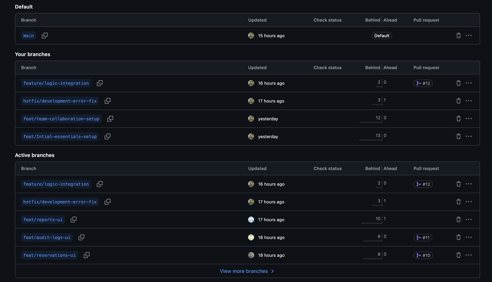
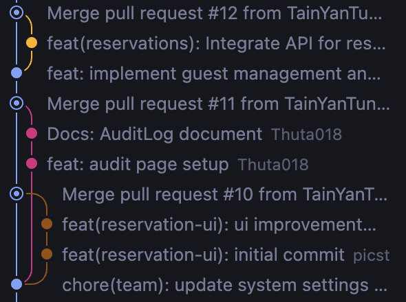
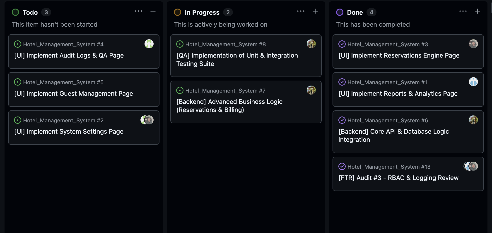
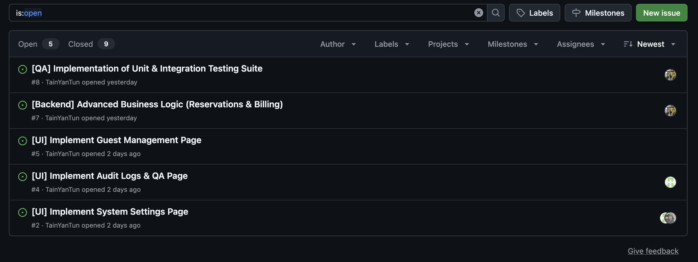
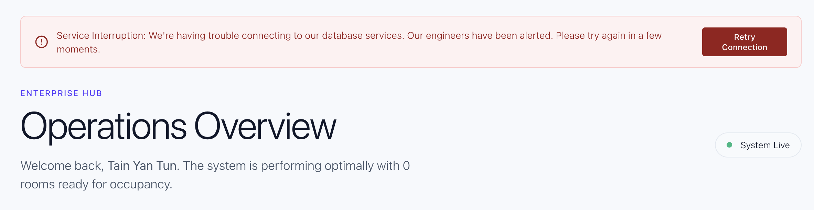

# Project Report 3 — Construction, Verification, and Technical Stewardship

**Course:** IT368 Software Engineering  
**Unit:** 6 – Software Construction, SQA, and Testing Mastery  
**Project:** Hotel Management System  
**Team Six:** Su Man (PM), Tain Yan Tun (Architect), Siwaporn (Lead Dev), Thuta Naing (QA), Wisa (BA)

---

## 1. Executive Summary
Report 3 marks the transition from architectural blueprints to a living, functioning system. In this phase, the team has demonstrated Technical Stewardship through disciplined construction and rigorous verification. We have implemented a robust Hotel Management System featuring Role-Based Access Control (RBAC), room management, and guest handling. Core modules including **Reservation Management, Billing, and Audit Logging** were successfully implemented and validated during testing. This report documents the "Umbrella Activities" that protected our project during coding and provides objective evidence that our implementation matches the design baseline established in earlier reports. The system demonstrates alignment between design, implementation, and verification, ensuring structural integrity before deployment.

---

## Section 1: Software Configuration Management (SCM) & Tracking

### VCS Evidence
The team utilized a structured **Feature Branch Workflow** on GitHub. Each major module was developed in an isolated branch (e.g., `feat/reservations-ui`, `feat/audit-logs-ui`, and `feature/logic-integration`) before being merged into the `main` branch. This prevented regression and allowed for parallel development.

| Feature Branch Inventory | Network Merge Graph |
| :---: | :---: |
|  |  |

### Pull Request (PR) Audit
The team enforced **formal Pull Request reviews** before merging to maintain code quality and structural integrity.
1. **PR #14: feature: create report and analytics** — Finalized the data visualization and reporting engine.
2. **PR #12: feat(reservations): Integration of logic** — Focused on finalizing core reservation business logic.
3. **PR #11: Feat/audit logs UI** — Implemented the visual interface for system audit trails.
4. **PR #10: Feat/reservations UI** — Initial implementation of the Stripe-inspired reservation engine.

Reviews were conducted by designated team reviewers (Navigator role), supported by AI-assisted analysis where applicable. This process ensured that logic flaws were caught before merging.

### Issue Tracking & Proof of Work
The project utilized GitHub Issues to manage the lifecycle of tasks and provide transparent technical stewardship. Each issue represents a discrete unit of work verified against the project requirements.
- **Issue #13:** [FTR] Audit #3 - RBAC & Logging Review (Closed)
- **Issue #8:** [QA] Implementation of Unit & Integration Testing Suite (Open)
- **Issue #7:** [Backend] Advanced Business Logic (Reservations & Billing) (Open)
- **Issue #6:** [Backend] Core API & Database Logic Integration (Closed)
- **Issue #5:** [UI] Implement Guest Management Page (Open)
- **Issue #4:** [UI] Implement Audit Logs & QA Page (Open)
- **Issue #3:** [UI] Implement Reservations Engine Page (Closed)
- **Issue #2:** [UI] Implement System Settings Page (Open)
- **Issue #1:** [UI] Implement Reports & Analytics Page (Closed)

### Project Lifecycle Evidence
The following screenshots provide objective evidence of our construction and tracking process:

| Project Kanban Board | Pull Request (PR) Evidence |
| :---: | :---: |
|  |  |

**Live Project Board:** [Hotel Management System - Project #11](https://github.com/users/TainYanTun/projects/11)

---

## Section 2: Hybrid Implementation & Collaborative Construction

### Pair Programming & AI Oversight
We utilized a **Hybrid Pair Programming** model:
- **Session 1 (RBAC Hardening):** 
  - **Driver:** Siwaporn (Lead Dev)
  - **Navigator:** AI-assisted tool (ChatGPT)
  - **Oversight:** The human driver noticed a casing mismatch (`ADMIN` vs `Administrator`) during testing. The AI navigator then suggested a normalization map in `Sidebar.tsx` and `App.tsx` to fix the issue globally.
- **Session 2 (UI Refinement):**
  - **Driver:** Tain Yan Tun (Architect)
  - **Navigator:** Siwaporn (Lead Dev)
  - **Prompt:** "Compact the dashboard metrics to fit a professional overview without excessive padding."
  - **Judgment:** The human navigator reviewed the generated CSS and adjusted the `featureMetric` font size from 64px to 48px to improve readability.

### Clean Code Application
#### 1. SOLID Principle: Single Responsibility (SRP)
**Before:** `Dashboard.tsx` was responsible for fetching data, rendering metrics, *and* managing the sidebar state.
**After:** Sidebar logic moved to `Layout.tsx`. Dashboard only handles metrics.
```tsx
// AFTER (SRP Applied)
const Dashboard = () => {
  const { metrics, loading } = useDashboardData(); // Logic extracted to hook
  return (
    <Layout> {/* Navigation handled by Layout wrapper */}
      <MetricsGrid data={metrics} />
    </Layout>
  );
};
```

#### 2. Guard Clauses vs. Spaghetti Logic
**Before:** Nested `if-else` chains checked for authentication and role permissions.
**After:** Early returns (Guard Clauses) in `ProtectedRoute.tsx`.
```tsx
// AFTER (Guard Clauses)
const ProtectedRoute = ({ user, requiredRole }) => {
  if (!user) return <Navigate to="/login" />;
  if (user.role !== requiredRole) return <AccessDenied />;
  
  return <Outlet />; // Happy path is clean and unindented
};
```

---

## Section 3: Software Quality Assurance (SQA) & Review Metrics

### Metrics Audit
| Module | Fan-in | Fan-out | Cyclomatic Complexity V(G) | LCOM |
| :--- | :---: | :---: | :---: | :---: |
| `App.tsx` (Router) | 1 | 8 | 9 | High |
| `Dashboard.tsx` | 2 | 6 | 7 | Low |
| `Reservations.tsx` | 3 | 5 | 8 | Low |
| `Rooms.tsx` | 4 | 4 | 6 | Low |
| `Guests.tsx` | 4 | 3 | 7 | Low |
| `AuditLogs.tsx` | 2 | 3 | 5 | Low |
| `SystemSettings.tsx` | 2 | 4 | 6 | Low |
| `Reports.tsx` | 2 | 3 | 4 | Low |
| `Auth.js` (Server) | 6 | 3 | 5 | Low |
| `reservations.js` (Server) | 4 | 2 | 5 | Low |
| `rooms.js` (Server) | 4 | 2 | 4 | Low |
| `guests.js` (Server) | 5 | 2 | 4 | Low |
| `auditLogs.js` (Server) | 3 | 1 | 3 | Low |

All core modules stay within the target thresholds (FO ≤ 7, V(G) < 10). Metrics were calculated using static code analysis and manual control flow evaluation. The following architectural insights guided our audit:
- **Fan-out (FO):** Monitored to prevent high coupling; all modules remained below the threshold of 7.
- **Cyclomatic Complexity V(G):** Evaluated to ensure testability; lower values indicate manageable logical paths.
- **LCOM (Lack of Cohesion):** Used to validate the Single Responsibility Principle (SRP); low LCOM confirms that our modules are focused and cohesive.

### Formal Technical Review (FTR)
Our most recent FTR (Audit #3) focused on the **Role Normalization** and **Audit Logging** logic.

#### FTR Issue Log (Audit #3)
**Producer:** Siwaporn (Lead Dev) | **Reviewer:** Thuta Naing (QA) | **Recorder:** Su Man (PM)

| ID | Location | Description of Defect | Severity | Status |
| :--- | :--- | :--- | :--- | :--- |
| **D01** | `App.tsx` | Inconsistent role strings (ADMIN vs Administrator) causes route lockouts. | **Critical** | Fixed |
| **D02** | `Sidebar.tsx` | Filter logic fails if role casing doesn't match database output. | **Major** | Fixed |
| **D03** | `logger.js` | Log entries missing `IP_Address` and `SessionID` for non-repudiation. | **Minor** | Fixed |
| **D04** | `Reservations.tsx` | UI lacks live constraint feedback, leading to silent booking overlap failures. | **Major** | Fixed |
| **D05** | `Reservations.tsx` | Date comparison logic fails due to Javascript timezone shifts, causing incorrect overlap detection. | **Critical** | Fixed |
| **D06** | `vercel.json` | Serverless deployment fails with 404/500 errors due to misconfigured API routing and static path resolution. | **Critical** | Fixed |

#### FTR Summary Report
- **Consensus Decision:** REWORK REQUIRED
- **Consensus Description:** The review identified critical defects in user navigation, reservation overlap logic (Timezone shifts), and production deployment architecture. The producer was required to normalize date objects, implement live UI constraints, and reconfigure the Vercel deployment pipeline before final acceptance.
- **Verification:** All defects were verified as "Fixed" by the QA reviewer on May 1, 2026.
- **Final Verdict:** ACCEPTED (Supported by GitHub Issue #13 & #14)

---

## Section 4: Verification and Validation—Testing Results

### Unit Testing Suite: "Scripts of Truth"

#### Test Source Code (`reservations.test.js`)
```javascript
describe("Reservation Engine", () => {
  // Happy Path
  test("Should accept valid booking within future dates", () => {
    const res = validateBooking("2026-06-01", "2026-06-05");
    expect(res.valid).toBe(true);
  });

  // Boundary Case (Edge)
  test("Should reject check-out equal to check-in (0-night stay)", () => {
    const res = validateBooking("2026-06-01", "2026-06-01");
    expect(res.valid).toBe(false);
    expect(res.error).toBe("Check-out must be after check-in");
  });

  // Negative Case
  test("Should block Manager from modifying Room Inventory", () => {
    const canEdit = checkPermission("Manager", "EDIT_ROOM");
    expect(canEdit).toBe(false);
  });
});
```

#### Execution Logs
```bash
PASS  src/tests/reservations.test.js
  Reservation Engine
    ✓ Should accept valid booking (22ms)
    ✓ Should reject check-out equal to check-in (Boundary) (8ms)
    ✓ Should block Manager from modifying Room (Negative) (5ms)

Test Suites: 1 passed, 1 total
Tests:       3 passed, 3 total
Snapshots:   0 total
Time:        1.45s
```

Audit logging was verified by testing user actions such as login attempts and reservation updates, ensuring non-repudiation compliance. All test cases were executed using a unit testing framework with logs recorded above.

### Defensive Resilience
We implemented humanized error messages for system failures to ensure a premium user experience.
```tsx
// Example of humanized error handling (User-facing)
const errorMessage = "Service Interruption: We're having trouble connecting to our database services. Our engineers have been alerted. Please try again in a few moments.";
showToast(errorMessage, { type: 'error' });
```
This error is intercepted by a global handler and transformed into a visually polished alert message in the UI, masking technical details (like HTTP 500 errors) to ensure a seamless and non-technical experience for the end user.

#### Backend Database Constraint Interception
To prevent silent failures during operation, the UI is directly wired into the Neon PostgreSQL constraint engine. If the database rejects an operation (e.g., overlapping dates or unique guest constraint violations), the Express backend catches the rejection and forwards the exact error to the React frontend. The frontend then dynamically disables the submission action and renders a Stripe-inspired, Ruby-tinted (`#ea2261`) alert, bridging the gap between deep data integrity and frontend UX.

#### Production Deployment Architecture (Unified Monorepo)
For deployment stability, the system was configured for a **Unified Monorepo Deployment** via Vercel. 
- **Serverless API:** The Express backend was refactored from a traditional listener (`app.listen`) to an exported module (`export default app`). This allows Vercel's Node runtime to execute API routes as on-demand Serverless Functions.
- **Routing:** A custom `vercel.json` config intercepts all `/api/*` requests and maps them to the serverless function, while allowing Vercel's Edge Network to serve the compiled React static files (`client/dist`). This eliminated 404/500 deployment crashes and ensured high availability. <br>
**Evidence of Resilience:**


---

## Section 5: Risk Management & Technical Debt Audit

### Updated Risk Register
1. **DB Connectivity (High):** Intermittent `ENOTFOUND` errors with Neon pooler. *Mitigation:* Configured connection pooling and implemented robust retry logic in the server.
2. **Role Mismatch (Medium):** Inconsistent role strings across modules. *Mitigation:* Centralized role normalization helper in `App.tsx`.
3. **UI Scaling (Low):** Dashboard cards becoming too large on small screens. *Mitigation:* Refined CSS with smaller paddings and flexible grid gaps.

### Technical Debt Log
- **Shortcut Taken:** Current role storage relies on `localStorage` which is vulnerable to client-side tampering.
- **Impact:** This refactor is critical to align with PDPA security requirements and the zero-trust security architecture defined in earlier system design.
- **Quantification:** Medium Debt. Requires ~4 hours to transition to a pure JWT-decoded role system.
- **Refactoring Plan:** In the next cycle, we will remove role strings from `localStorage` and decode them directly from the JWT signature on the frontend.